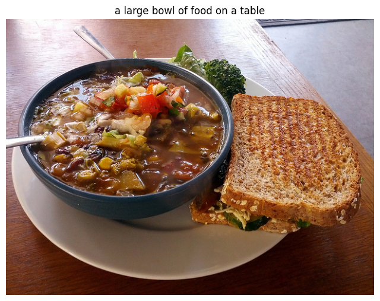
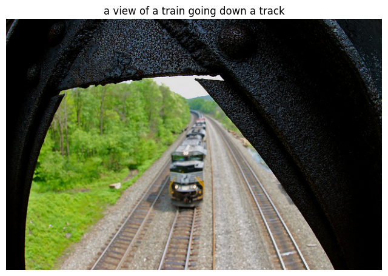

# Small image captioning transformer 

A small yet computationally efficient image captioning model with fast token processing. There is an image and a text encoding part that is fused together using a cross-attention module [2]. The captions are generated in an autoregressive manner.

Ttraing dataset is the COCO captioning dataset [1].

### Model complexity

|Backbone|FLOPS[G]|Params[M]|
|---|---|---|
|CNNEncoder (resnet18 based)|6.41|39.31|
|VitEncoder (Vision Transformer)|11.46|87.40|

### References
[1. COCO - Common Objects Context](https://cocodataset.org/#home)
[2. Attention Is All You Need](https://arxiv.org/abs/1706.03762)

/Enjoy.
